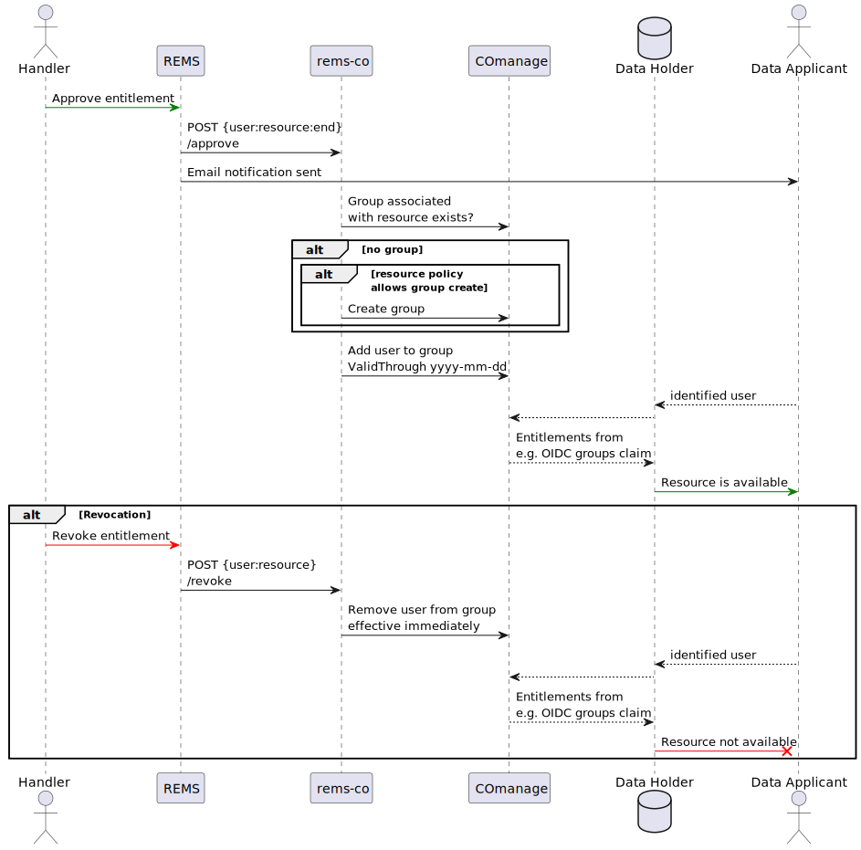

# rems-co

**Seamless entitlement synchronization between REMS and COmanage Registry**

---

**rems-co** is a lightweight bridge service that automatically synchronizes user entitlements between [REMS](https://github.com/CSCfi/rems) (Resource Entitlement Management System) and a COmanage Registry. 

When data handlers approve or revoke access to resources in REMS, **rems-co** ensures those decisions are immediately reflected as group membership changes in COmanage. This enables seamless access control for research data resources through OIDC group claims and other registry-managed access mechanisms.

## Why this?

In research data infrastructure, **COmanage** commonly provides an identity registry solution while **REMS** excels at workflow-driven entitlement management. **rems-co** bridges this gap by:

- **Automating manual processes** — No more manual group creation or updates when entitlements change
- **Ensuring real-time sync** — Access changes take effect immediately via webhook processing
- **Reducing operational overhead** — DevOps teams can deploy once and forget
- **Enabling policy-driven automation** — Configurable rules for automatic group creation

## How it works

**rems-co** listens for REMS webhook events and processes them with simple business logic:

1. **Approval events** (`/approve`) add users to corresponding COmanage groups
2. **Revocation events** (`/revoke`) remove users from groups immediately  
3. **Missing groups** are created automatically based on configurable resource patterns
4. **Group memberships** flow through COmanage to provide actual resource access

## Key Features

- **Prebuilt Docker image** — Deploys seamlessly with `docker-compose`
- **Policy-configurable** — Control which resources get automatic group creation
- **Production-ready** — Designed for integration with existing REMS/COmanage infrastructure

## See also

- [`DEVELOP.md`](./DEVELOP.md) — developer setup and testing
- [`CONFIGURE+DEPLOY.md`](./CONFIGURE+DEPLOY.md) — deployment and configuration instructions
- [**REMS project**](https://github.com/CSCfi/rems)
